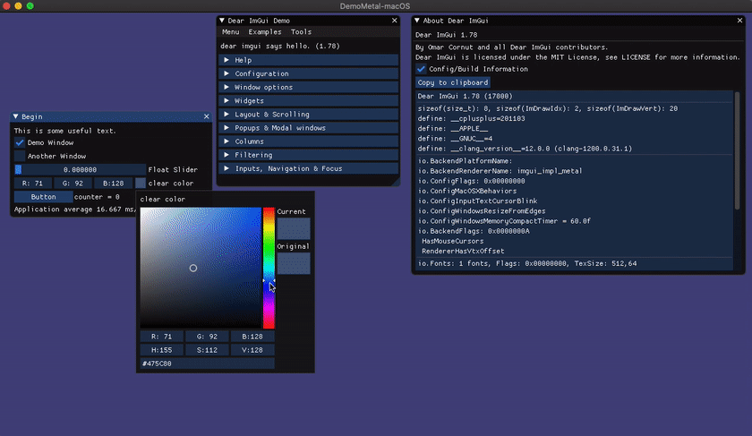

# Swift ImGui
[](https://travis-ci.com/ctreffs/SwiftImGui)
[](LICENSE)
[](https://swift.org/download)
[](#)
[](#)

<div style="margin: auto 0; text-align: center;"></div>


This is a **lightweight**, **auto-generated** and **thin** Swift wrapper around the popular and excellent [**dear imgui**](https://github.com/ocornut/imgui) library.  
It provides a **swiftly** and **typesafe** API and is easily maintainable and updatable, since it relies heavily on auto-generation.

There are a working [demo examples](Sources/Demos/) provided as part of the library.

## 🚀 Getting Started

These instructions will get you a copy of the project up and running on your local machine and provide a code example.

### 📋 Prerequisites

* [Swift Package Manager (SPM)](https://github.com/apple/swift-package-manager)
* [Swiftlint](https://github.com/realm/SwiftLint) for linting - (optional)
* [SwiftEnv](https://swiftenv.fuller.li/) for Swift version management - (optional)

### 💻 Installing

Swift ImGui is available for all platforms that support [Swift 5.0](https://swift.org/) and higher and the [Swift Package Manager (SPM)](https://github.com/apple/swift-package-manager).

Extend the following lines in your `Package.swift` file or use it to create a new project.

```swift
// swift-tools-version:5.0

import PackageDescription

let package = Package(
    name: "YourPackageName",
    dependencies: [
        .package(url: "https://github.com/ctreffs/SwiftImGui.git", from: "1.0.0")
    ],
    targets: [
        .target(
            name: "YourTargetName",
            dependencies: ["ImGui"])
    ]
)

```


## 📝 Code Example

A minimal example is located at [Sources/Demos/Minimal/main.swift](Sources/Demos/Minimal/main.swift).   
This is an excerpt:

```swift
import ImGui

IMGUI_CHECKVERSION()
let ctx = ImGuiCreateContext(nil)
let io = ImGuiGetIO()!

/// Build font atlas
var pixels: UnsafeMutablePointer<UInt8>?
var width: Int32 = 0
var height: Int32 = 0
var bytesPerPixel: Int32 = 0
ImFontAtlas_GetTexDataAsRGBA32(io.pointee.Fonts, &pixels, &width, &height, &bytesPerPixel)

for n in 0..<20 {
    io.pointee.DisplaySize = ImVec2(x: 1920, y: 1080)
    io.pointee.DeltaTime = 1.0 / 60.0
    ImGuiNewFrame()
    ImGuiTextV("Hello, world!")
    ImGuiSliderFloat("float", &f, 0.0, 1.0, nil, 1)
    ImGuiShowDemoWindow(nil)
    ImGuiRender()
}

ImGuiDestroyContext(ctx)
```

## 🆕 Update SwiftImGui

SwiftImGui uses a mutli stage process to update to the latest imgui version.   
All necessary steps are available and automated via [`Makefile`](Makefile).   
In repository root run:

1. `make buildCImGui` - Update cimgui submodule && generate C interface
2. `make wrapLibImGui` - Update SwiftImGui && auto-wrap C interface


## 💁 Help needed

This project is in an early stage an needs a lot of love.
If you are interested in contributing please feel free to do so!

Things that need to be done among others are:

- [ ] Extend the AutoWrapper to wrap more cimgui functions (currently there are 55 'invalid' functions that will not be wrapped. 543 will be wrapped properly.)
- [ ] Some vector functions are not available via the c interface - see `Sources/AutoWrapper/Exceptions.swift`
- [ ] Find a solution for manual adjustments in cimgui generator template
- [ ] Write some more tests

## 🏷️ Versioning

We use [SemVer](http://semver.org/) for versioning. For the versions available, see the [tags on this repository](tags). 

## ✍️ Authors

* [Christian Treffs](https://github.com/ctreffs)

See also the list of [contributors](https://github.com/ctreffs/SwiftImGui/blob/master/project/contributors) who participated in this project.

## 🔏 Licenses

This project is licensed under the MIT License - see the [LICENSE](LICENSE) file for details.

* imgui licensed under [MIT License](https://github.com/ocornut/imgui/blob/master/LICENSE.txt)
* CImGui licensed under [MIT License](https://github.com/cimgui/cimgui/blob/master/LICENSE)

## 🙏 Original code

Since SwiftImGui is merely a wrapper around [**imgui**](https://github.com/ocornut/imgui) it obviously depends on it.    
It also makes use of the excellent c-api wrapper [**cimgui**](https://github.com/cimgui/cimgui).   
Support them if you can!

### imgui

##### From [ocornut/imgui/docs/README.md](https://github.com/ocornut/imgui/blob/master/docs/README.md):

<sub>(This library is available under a free and permissive license, but needs financial support to sustain its continued improvements. In addition to maintenance and stability there are many desirable features yet to be added. If your company is using dear imgui, please consider reaching out. If you are an individual using dear imgui, please consider supporting the project via Patreon or PayPal.)</sub>

Businesses: support continued development via invoiced technical support, maintenance, sponsoring contracts:
<br>&nbsp;&nbsp;_E-mail: contact @ dearimgui dot org_

Individuals/hobbyists: support continued maintenance and development via the monthly Patreon:
<br>&nbsp;&nbsp;[](http://www.patreon.com/imgui)

Individuals/hobbyists: support continued maintenance and development via PayPal:
<br>&nbsp;&nbsp;[](https://www.paypal.com/cgi-bin/webscr?cmd=_s-xclick&hosted_button_id=WGHNC6MBFLZ2S)

----

Dear ImGui is a **bloat-free graphical user interface library for C++**. It outputs optimized vertex buffers that you can render anytime in your 3D-pipeline enabled application. It is fast, portable, renderer agnostic and self-contained (no external dependencies).

Dear ImGui is designed to **enable fast iterations** and to **empower programmers** to create **content creation tools and visualization / debug tools** (as opposed to UI for the average end-user). It favors simplicity and productivity toward this goal, and lacks certain features normally found in more high-level libraries.

Dear ImGui is particularly suited to integration in games engine (for tooling), real-time 3D applications, fullscreen applications, embedded applications, or any applications on consoles platforms where operating system features are non-standard.


### cimgui

##### From [cimgui/cimgui/README.md](https://github.com/cimgui/cimgui/blob/master/README.md)

CImGui is a thin c-api wrapper programmatically generated for the excellent C++ immediate mode gui Dear ImGui. All imgui.h functions are programmatically wrapped. Generated files are: cimgui.cpp, cimgui.h for C compilation. Also for helping in bindings creation, definitions.lua with function definition information and structs_and_enums.lua. This library is intended as a intermediate layer to be able to use Dear ImGui from other languages that can interface with C (like D - see D-binding)


## ☮️ Alternatives

* [mnmly/Swift-imgui](https://github.com/mnmly/Swift-imgui)
* [troughton/SwiftImGui](https://github.com/troughton/SwiftImGui)
